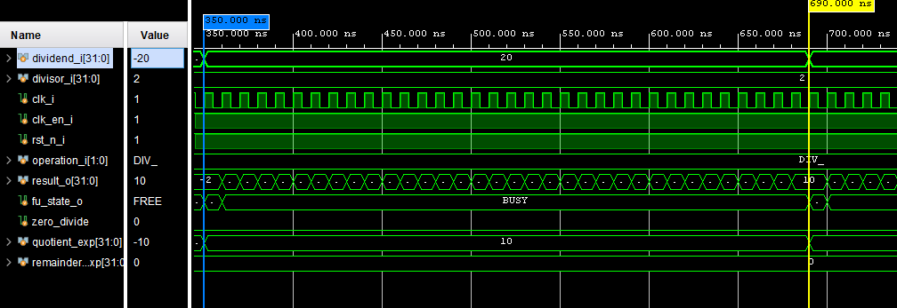

# DIVIDE UNIT

The multiply unit is responsable for all the four division instructions in the "M" RISC-V extension.

## **CUSTOM MODULE**

The custom module is designed for low resources usage and low area, obviusly because of the tradeoffs it is also relatively slow. It's not
pipelined, thus it can accept new values only when the unit is `FREE`. It has 34 latency cycles, and it perform both signed and unsigned division as well as the `MOD` operation (REM in RISC-V or remainder). The module implement the **non restoring division algorithm**, this works on unsigned data, so we must convert all the inputs in unsigned, elaborate them and change the sign of the result accordingly.

---

### **Example:**

Cycle time: 10ns.

We start at T = 350ns performing (20 / 2) integer division. The unit has 34 latency cycle so it will produce a *valid* result in T = 350ns + 340ns -> 690ns

At T = 690ns the unit will be `FREE` and **in the same clock cycle it can receive new values**.

---

The Vivado Synthesis Tool estimate an usage of:

| **Used:**                       | LUT  | LUTRAM |  FF  | BRAM | URAM | DSP |
| :--------------------------     | :-:  | :----: | :--: | :--: | :-:  | :-: |
| Divider module                  | 310  |   0    |  108 |  0   |  0   |  0  |

 

## **IP MODULE**

It implement two Xilinx's IP modules:

  * A **signed divider**
  * An **unsigned divider**

These modules **are not pipelined**, so we'll need to wait L + 1 (latency) clock cycles to insert new values, thus we need to 
inform the pipeline that the unit is busy if there's a divide instruction in flight in the unit.

The signed divider has a latency of 36 clock cycles, while the unsigned one has 34. Because of this we insert two flip flops
to extend the latency and porting it at 36 clock cycles.

After 36 clock cycles the modules produce the output and we need to wait another clock cycle to insert new values for a total of 37 cycles.

To keep track of the usage of the unit we use a counter which count till 36 before resetting to 0. When the counter is equal to
0 it means that the unit is free and it has completed his task.

---

### Example:

Cycle time: 10ns.

Starting in T = 20ns, we perform 100 / 5 integer division, using the above information we'll recive the result at 360ns + 20ns = 380ns. The result will be
20 if we perform the DIV instruction. After 1 cycle (at 390ns) we can insert other inputs.

The result after the 37th cycle won't be valid.

---

The Vivado Synthesis Tool estimate an usage of:

| **Used:**                       | LUT    | LUTRAM |  FF   | BRAM | URAM | DSP |
| :--------------------------     | :-:    | :----: | :--:  | :--: | :-:  | :-: |
| Signed divider                  |  1327  |   5    |  3443 |  0   |  0   |  0  |
| Unsigned divider                |  1197  |   2    |  3306 |  0   |  0   |  0  | 
| Top module (without multipliers)|  169   |   0    |  134  |  0   |  0   |  0  |
| TOTAL                           |  2693  |   7    |  6883 |  0   |  0   |  0  |
