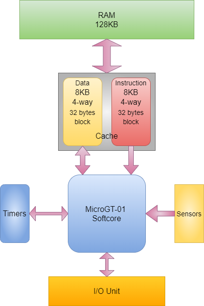

# **MicroGT-01 RISC-V SOFTCORE**

Github: (https://github.com/GabbedT/RV32IMAF-MicroGT_01)

MicroGT_01 is the first core of the series MicroGT written in SystemVerilog, it is a 32bit OoO execution RISC-V core, 6 stage deep pipeline, designed for low energy consumption. Outside the core, there are two caches and a module for I/O and memory management.

It is possible to implement it on a Xilinx FPGA, for example a [Basys 3](https://store.digilentinc.com/basys-3-artix-7-fpga-beginner-board-recommended-for-introductory-users/). For now this project implement some Xilinx's IPs *to achieve higher performance and lower the resources usage* (for example for math functions block. The files that have `_IP.sv` contain IPs blocks), thus **it's not a portable design**. 

MicroGT_01 **is not designed for commercial purpouse but for educational**, I belive the best method to learn how CPU's work is to design one by yourself! However if you want to 
use this softcore in your design you are free to do so.

## **WARNING!**
---

Since it's not a completed project, the following text is not 100% correct and it will probably be modified.

# **Overview**
---

## **MicroGT-01 top level view:**

 

  

The bus system is not implemented yet.

The **sensors** comprehend different devices for:
  * CPU energy consumption detection
  * CPU temperature detection

They are used to monitor the CPU's status and lower the clock frequency if necessary.

**Timers** are used for various application.

As the image tells, **caches** are 4-way associative 8KB large, each block in a set is 32 bytes long and they implement the following policies:
  * Pseudo LRU: a simplyfied LRU algorithm
  * Write through
  * No-write allocate

These policies are selected to keep caches design simple thus using less resources.

The **I/O unit** implement different communication protocols as discussed later.

All these things are discussed more in depth, you can find the documents in the Docs 
folder.

---

## **MicroGT-01 microarchitecture:**

 

  

### **Instruction fetch (IF):**

  * The **prefetch unit** fetch an entire cache line frome the instruction cache.
  * The **exception detector** monitors the instruction address.
  * The **handler** detect the various interrupt / exception signals and handle them in order.
  * The **FIFO buffer** makes sure that the instructions enter in the **decode** stage sequentially.

### **Instruction decode (ID):**

  * The **decoder** decodes the instruction generating the various pipeline signals.
  * The **exception detector** monitors the opcodes and the various function fields.
  * The **BTA** (Branch Target Address) is calculated in this stage.
  * The **branch predictor** is used to choose whether taking a branch or not.

### **Instruction issue (IS):**

  * **Reads operands** from the register files.
  * The **scoreboard** schedule the various instructions depending on the operation latency and the various **`RAW`**, **`WAW`**, **`WAR`** and **structural** hazards.
  * Here the instructions are issued **in order**.

### **Execute (EX)**

  * **Merged** with the **`MEM`** stage to allow loads and stores to execute out of order.
  * The **ALU** perform the basic operations.
  * The **MUL/DIV unit** perform multiplication and division. 
  * The **FPU** perform all the floating poin operations.
  * The **Load/Store unit** is divided in to:
    * **Store unit**, it waits until all the instructions are correctly committed to make sure that when an exception rise the memory isn't affected. The unit does this by storing the values in to a **queue**. The queue, sends data to the memory once it recieve the `commit` signal. 
    * **Load unit**, simply load values from the memory, it works closely with the **store queue**. In fact, before accessing the memory, it checks the values stored in the queue.
  * The **exception detector** monitor the various functional units operations.
  * The **fowarding unit** is controlled directly by the scoreboard.

### **Write Back / Commit (WB)**

  * The only unit in this stage is the **reorder buffer (ROB)**. It reorder the various instructions executed **out of order** and commits them **in order**. The most important thing about the ROB is that it allows the pipeline to have **precise exceptions**.

 

 

# **Features**

### **Core**:
---
* 32-bit RISC-V CPU softcore.
* Support for RISC-V extension:
  * **I**: Integer base instructions.
  * **M**: Integer multiplication and division instructions.
  * **F**: Single-Precision Floating Point instructions.
* Support for privilege levels:
  * **M**: Machine level.
  * **U**: User level.
* Variable clock frequency based on energy consumption and chip's temperature: 
  * High performance: 100MHz
  * Normal performance: 50MHz
  * Energy saving: 10MHz
* Simple branch predictor.

### **External**:
---
* Parameterizable modules like RAM, Caches etc.
* Two different 8KB caches (expandable): one for the instruction and one for data.
* Unified 128KB RAM (expandable).
* Different I/O device support:
  * UART
  * SPI
  * I^2C
  * VGA
  * GPIO
  * LCD

 

# **Documentation**

All the documents are in the Docs folder in this repository, here you can find description about architectural and microarchitectural design.
